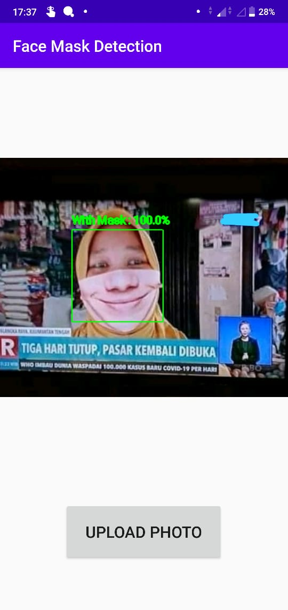
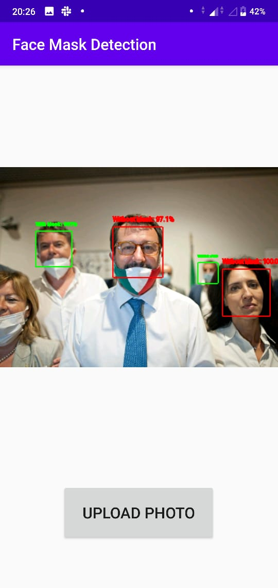

# Face Mask Detection

This repository contain our Final <a href="https://events.withgoogle.com/bangkit/">Bangk!t</a> group assignment.


Member:  
* [Cindy Alifia Putri](https://github.com/Cindyalifia)
* [Fajar Muslim](https://github.com/fajarmuslim)
* [Florence Nightingle Manurung](https://github.com/florencemnrg)

In this repo, we do object detection project using TensorFlow API to detect face masked.

We use MAFA Datasets that originally store <a href="https://www.kaggle.com/ashishjangra27/face-mask-12k-images-dataset"> here</a>. 

## How To Use
1. Clone this repository
```
$ git clone https://github.com/florencemnrg/face-mask-detection.git
```
2. Now, run FACE_MASK_DETECTION on your android studio to initialize the program on your device while plug your device on your computer and ensure that your USB Debugging is active. 
3. There you go, you can use the apps now.


## Training Steps
1. Data Pre-processing:
Gathering images using kaggle API,
Load and visualise some image to improve our analysis to the data.

2. Download related repository:
- Full TensorFlow object detection repository > <a href="https://github.com/tensorflow/models.git"> Github Repository</a>
- MobileNetV2 for object detection > <a href="https://github.com/tensorflow/models/tree/master/research/slim/nets/mobilenet"> Github Repository </a>

3. Modelling: 
- Set up baseline model (mobileNetV2) as a pretrained model
- Freeze all mobileNetV2's layer
- Fine tuning with our dense layer
- Set up the hyperparameter
- Train the model
- Keep an eye on the validation accuracy and validation loss, we got 99.75% of data validation
- Save weight **.h5 file** which you can found on Modelling directory. And don't forget to save **model.tflite** and also **label.txt** for deployment on Android which you can also look up on Modelling directory.

## Results
Report of this project are available <a href=""> here</a> in the form of slides.

## Model
You can find the machine learning model in this directory : "modelling/model.05-0.00.h5". About prerequisite to android deployment file, you can found here : "modelling/tflite_model/labels.txt" and "modelling/tflite_model/model.tflite".

## Deployment
1. First you need to create a project in android studio, you can read the documentation here <a href="https://developer.android.com/kotlin/get-started"> Get Started with Kotlin on Android </a> . 
2. Next after creating a project using Kotlin, you need to download labels.txt and model.tflite from this directory folder "modelling/tflite_model" and put both of them to this directory folder YOUR_ANDROID_PROJECT/app/src/main/assets. Folder assests is a new folder that you need to create by your self. Or you can read the documentation here <a href="https://www.tensorflow.org/lite/guide/android"> Android quickstart</a>. 
3. Last but not least, you need to build a bounding box using kotlin, and here's the documentation <a href="https://developer.android.com/reference/android/media/FaceDetector"> FaceDetector </a>. 

## Demo
### Here are the example of our program testing :




## Conclusions
Our model can detect whether someone is using mask or not. We also prove that using mobileNetV2 as a pretrained model can improve the accuracy and not heavy to deploy on Android. 
